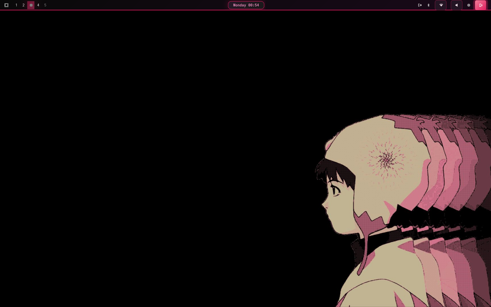
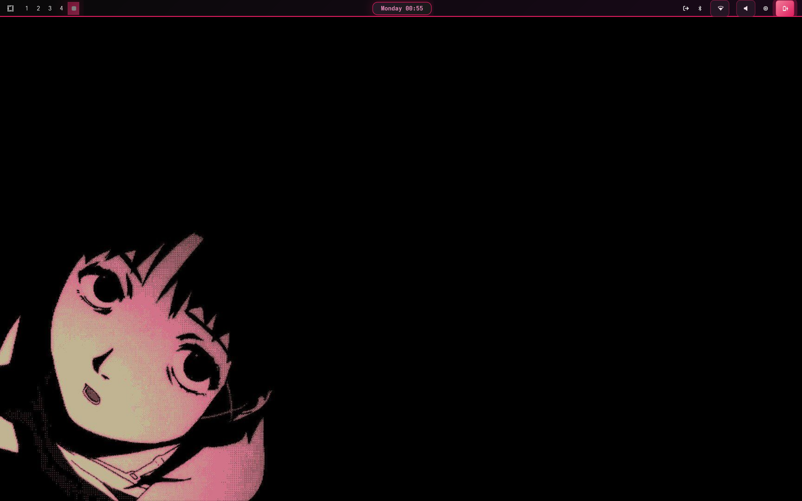

# LainOm - Anime Pink Theme 

A comprehensive anime-inspired pink/magenta theme for Linux desktop environments, featuring a cohesive color palette across multiple applications and window managers.

 <!-- Add your screenshot here -->

## 🎨 Color Palette

The theme is built around a carefully crafted anime-inspired color scheme:

- **Primary Background**: `#0a0a0a` (Deep Black)
- **Primary Foreground**: `#ffeef7` (Light Pink)
- **Accent Pink**: `#e91e63` (Magenta)
- **Bright Pink**: `#ff4081` (Bright Pink)
- **Light Pink**: `#ff99cc` (Soft Pink)
- **Salmon Pink**: `#ff85a2` (Warm Pink)
- **Deep Pink**: `#d147a3` (Dark Magenta)

## 📦 What's Included

This theme provides configurations for:

- **Terminal**: Alacritty
- **System Monitor**: btop
- **Screen Locker**: Hyprlock
- **Window Manager**: Hyprland
- **Notifications**: Mako
- **Text Editor**: Neovim
- **OSD**: SwayOSD
- **Application Launcher**: Walker, Wofi
- **Status Bar**: Waybar

## 🚀 Installation

### Prerequisites

Make sure you have the following applications installed:
- Alacritty
- btop
- Hyprland
- Mako
- Neovim
- Wofi/Walker
- Waybar
- CaskaydiaMono Nerd Font

### Quick Install

1. **Clone the repository**:
   ```bash
   git clone https://github.com/yourusername/lainom-theme
   cd lainom-theme
   ```

2. **Backup your existing configs** (recommended):
   ```bash
   mkdir -p ~/.config/backup
   cp -r ~/.config/alacritty ~/.config/backup/ 2>/dev/null || true
   cp -r ~/.config/btop ~/.config/backup/ 2>/dev/null || true
   cp -r ~/.config/hypr ~/.config/backup/ 2>/dev/null || true
   cp -r ~/.config/mako ~/.config/backup/ 2>/dev/null || true
   cp -r ~/.config/waybar ~/.config/backup/ 2>/dev/null || true
   cp -r ~/.config/wofi ~/.config/backup/ 2>/dev/null || true
   ```

3. **Install the theme**:
   ```bash
   ./install.sh
   ```

### Manual Installation

If you prefer to install components individually:

#### Alacritty
```bash
mkdir -p ~/.config/alacritty
cp alacritty.toml ~/.config/alacritty/
```

#### btop
```bash
mkdir -p ~/.config/btop/themes
cp btop.theme ~/.config/btop/themes/anime-pink.theme
# Then select the theme in btop: ESC → o → t → anime-pink
```

#### Hyprland
```bash
mkdir -p ~/.config/hypr
cp hyprland.conf ~/.config/hypr/
# Add to your main hyprland.conf: source = ~/.config/hypr/anime-pink.conf
```

#### Hyprlock
```bash
mkdir -p ~/.config/hypr
cp hyperlock.conf ~/.config/hypr/hyprlock.conf
```

#### Mako
```bash
mkdir -p ~/.config/mako
cp mako.ini ~/.config/mako/config
```

#### Neovim
```bash
mkdir -p ~/.config/nvim/colors
cp neovim.lua ~/.config/nvim/colors/anime_pink.lua
```
Then in your Neovim config:
```lua
vim.cmd('colorscheme anime_pink')
```

#### Waybar
```bash
mkdir -p ~/.config/waybar
cp waybar.css ~/.config/waybar/style.css
```

#### Wofi
```bash
mkdir -p ~/.config/wofi
cp wofi.css ~/.config/wofi/style.css
```

#### Walker
```bash
mkdir -p ~/.config/walker
cp walker.css ~/.config/walker/style.css
```

#### SwayOSD
```bash
mkdir -p ~/.config/swayosd
cp swayosd.css ~/.config/swayosd/style.css
```

## 🎯 Configuration

### Font Requirements

This theme uses **CaskaydiaMono Nerd Font**. Install it with:

```bash
# Arch Linux
sudo pacman -S ttf-cascadia-code-nerd

# Ubuntu/Debian
wget https://github.com/ryanoasis/nerd-fonts/releases/download/v3.0.2/CascadiaCode.zip
unzip CascadiaCode.zip -d ~/.local/share/fonts/
fc-cache -fv
```

### Background Image

For Hyprlock, you need to add your own anime background image:
```bash
mkdir -p ~/.config/omarchy/themes/anime-pink/backgrounds/
# Place your anime background image here and name it:
# anime_girl_pink.jpg
```

**Note**: The theme expects a background image at this specific path. You can either:
- Add your own anime-style background image
- Modify the `hyperlock.conf` file to point to a different image
- Remove the background configuration to use a solid color instead

### Application-Specific Setup

#### btop
1. Open btop
2. Press `ESC` → `o` → `t`
3. Select `anime-pink` theme

#### Neovim
Add to your `init.lua`:
```lua
vim.cmd('colorscheme anime_pink')
```

#### Waybar
Ensure your waybar config references the correct CSS file:
```json
{
    "layer": "top",
    "modules-left": ["hyprland/workspaces"],
    "modules-center": ["clock"],
    "modules-right": ["pulseaudio", "network", "battery"]
}
```

## 🎨 Customization

### Changing Colors

All colors are defined at the top of each configuration file. To customize:

1. Choose your preferred color palette
2. Update the color variables in each config file
3. Restart the respective applications

### Adding New Applications

To extend this theme to other applications:

1. Use the color palette defined above
2. Follow the established patterns for gradients and opacity
3. Maintain consistency with border radius (8-12px) and shadows

## 🔧 Troubleshooting

### Common Issues

**Colors not applying:**
- Ensure you've restarted the application after copying configs
- Check file permissions: `chmod 644 ~/.config/app/config`

**Font not displaying correctly:**
- Verify CaskaydiaMono Nerd Font is installed: `fc-list | grep -i cascadia`
- Refresh font cache: `fc-cache -fv`

**Waybar not styling:**
- Check that the CSS file path is correct in waybar config
- Restart waybar: `pkill waybar && waybar &`

**Neovim theme not loading:**
- Ensure the file is in the correct location: `~/.config/nvim/colors/anime_pink.lua`
- Check for syntax errors: `:messages` in Neovim

### Getting Help

If you encounter issues:
1. Check the application's log files
2. Verify configuration syntax
3. Open an issue on GitHub with your system info and error messages

## 📸 Screenshots


 
 
 
 
<!-- Add screenshots of each application here -->

## 🤝 Contributing

Contributions are welcome! Please:

1. Fork the repository
2. Create a feature branch
3. Test your changes thoroughly
4. Submit a pull request

### Adding Support for New Applications

When adding support for a new application:
- Use the established color palette
- Follow existing naming conventions
- Include installation instructions
- Add screenshots

## 📄 License

This project is licensed under the MIT License - see the [LICENSE](LICENSE) file for details.

## 🙏 Credits

- Inspired by anime aesthetics and pink/magenta color schemes
- Built for the Linux desktop community
- Special thanks to all the application developers

## 💖 Support

If you enjoy this theme, consider:
- ⭐ Starring the repository
- 🐛 Reporting bugs
- 🎨 Contributing improvements
- 📢 Sharing with the community

---

**Made with 💖 for the anime and Linux communities**
